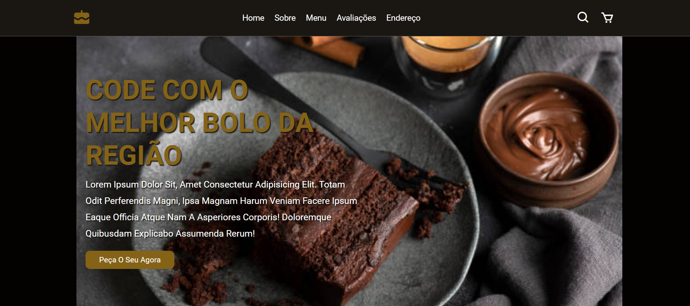
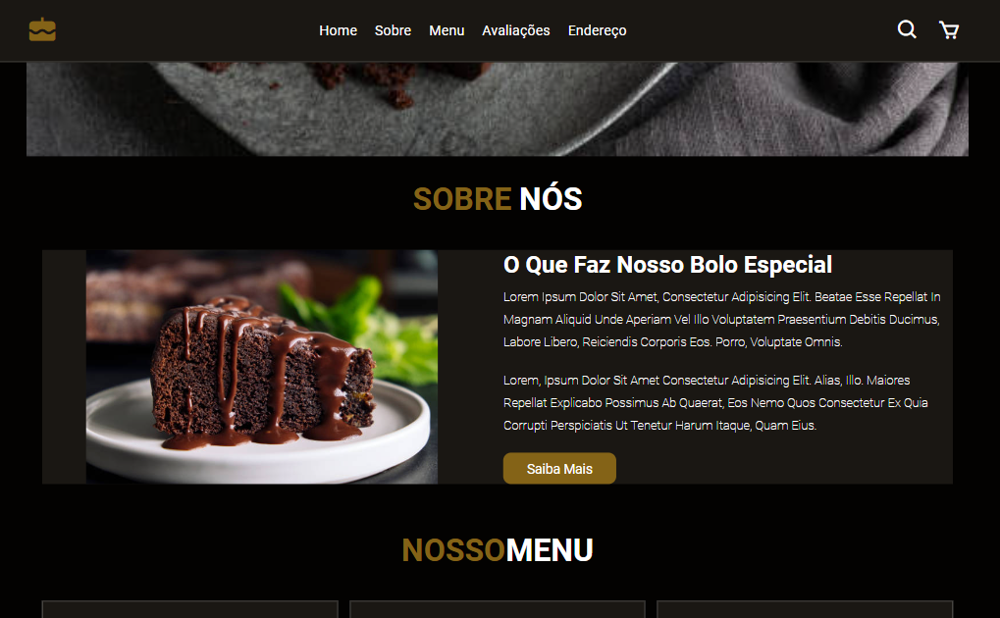
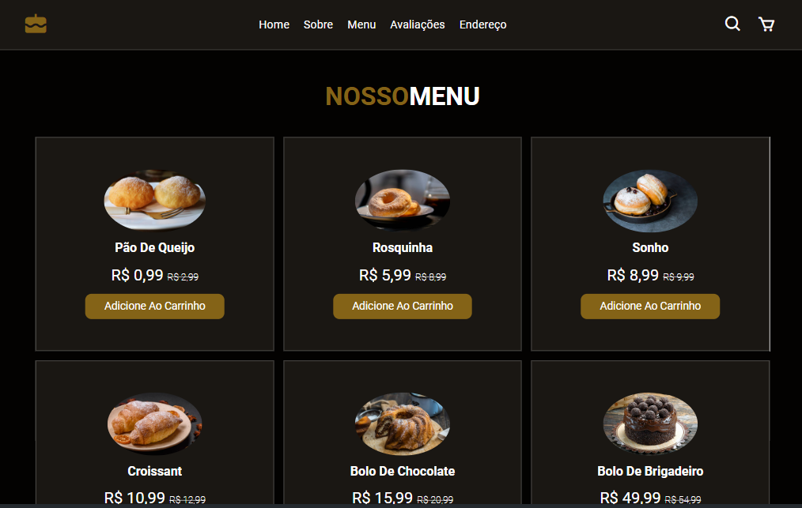
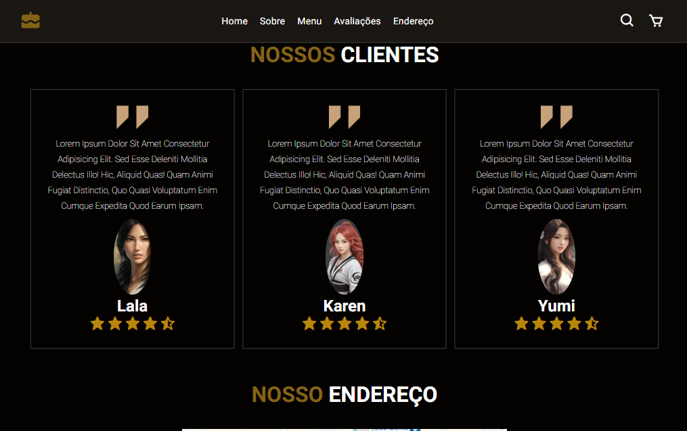
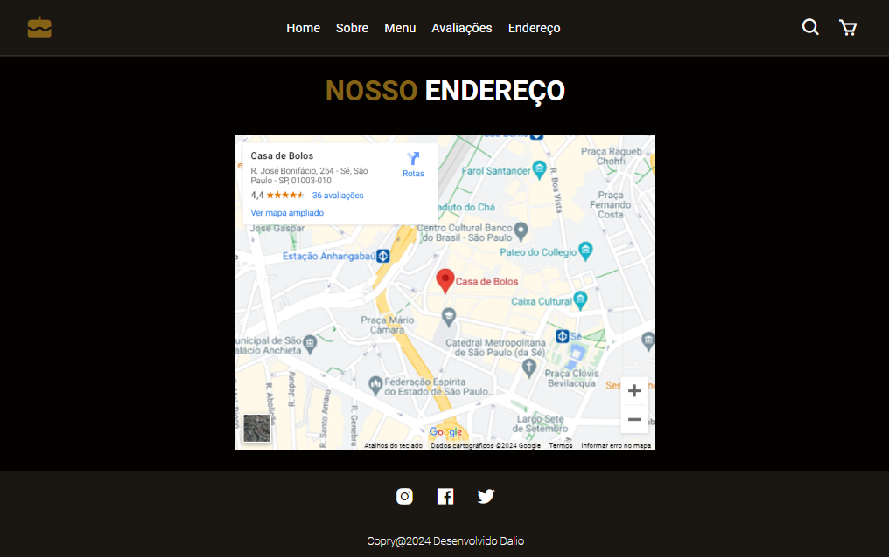

<h1 align="center">Projeto Casa de Bolo</h1>

<h2>Olá sejam bem-vindo</h2>

Projeto Casa de Bolo

Compartilho com entusiasmo meu mais recente projeto: a Casa de Bolo! Um site confeitado com HTML e CSS, que celebra a magia e a delícia dos bolos caseiros.

<h4>Desenvolvimento:</h4>

<ul>
<li>HTML: Estrutura robusta e organizada, com foco em acessibilidade e semântica.</li>
<li>CSS: Design vibrante e convidativo, com cores doces e ilustrações encantadoras.</li>
<li>Layout responsivo: Adapta-se perfeitamente a qualquer tela, seja desktop, tablet ou smartphone.</li>
</ul>

<h4>Link:</h4>

>Deploy: https://daliosy.github.io/ccake-house

>Repoditório: https://github.com/DalioSY/cake-house

>Linkedin: https://www.linkedin.com/in/dalio-s-yamada/

#webdesign #html #css #bolos #casadebolo 
 

  <ul align="center">
    <h2 style="display: inline-block">Imagens:</h2>
  </ul>

 
  
  
  
  
  

